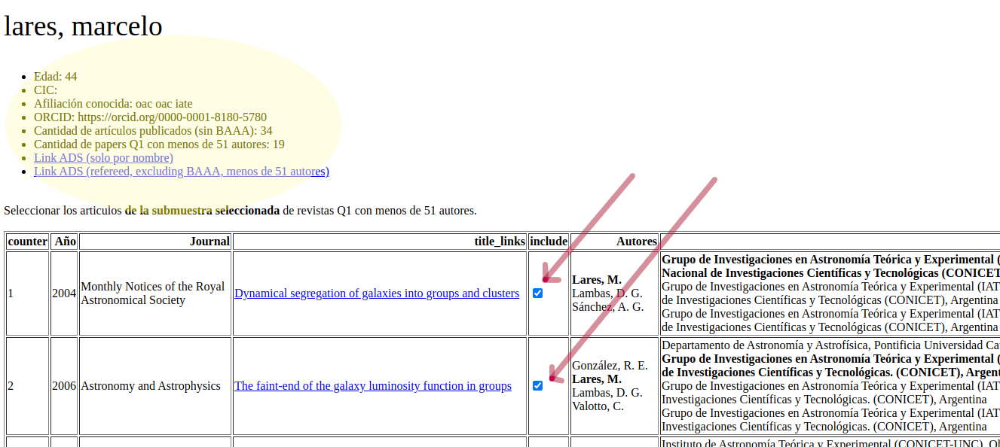
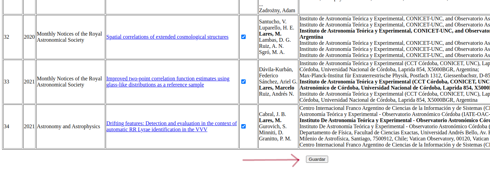

Dataset
====================================

GENDER BALANCE IN THE ARGENTINA ASTRONOMY WORKFORCE

This dataset is published in http://dryad/datasets/astrogen,
see that link for full access to the data.

Metadata
--------

Dataset compiled from several oficial and public sources about the career
development for astronomers in Argentina.

- Marcelo Lares [1, 2, 3] ORCID:
- Valeria Coenda [1, 2, 3] ORCID:
- Luciana Gramajo [1, 2, 3] ORCID:
- Héctor Julián Martínez-Atencio [1, 2, 3] ORCID:
- Celeste Parisi [1, 2, 3] ORCID:
- Cinthia Ragone [1, 3] ORCID:

Affiliations:

- 1) Instituto de Astronomía Teórica y Experimental (IATE)
- 2) Observatorio Astronómico de Córdoba (OAC)
- 3) CONICET

Contact: Marcelo Lares

Date of data collection: Nov 29, 2021

GEOGRAPHIC LOCATION: Argentina

KEYWORDS: gender balance, astronomy

LANGUAGE: English

Funding sources: The authors acknowledge founding from CONICET and SECYT,
although to granted for this project especifically.

Data and file overview
----------------------

We provide a single file containing an SQL database with five tables:

==============  ==============  ===============
table           #elements       #columns
==============  ==============  ===============
famaf           210             6
people          838             19
papers          341825          9
==============  ==============  ===============

* famaf

Count of male and female students, by year and year of enrollment.

+--------+----------+---------+-----------------------------------------------+
| Column |  Name    | format  | description                                   |
+========+==========+=========+===============================================+
| 1      | year     | INT     | year the count of students is made            |
+--------+----------+---------+-----------------------------------------------+
| 2      | year_in  | INT     | year of enrollment                            |
+--------+----------+---------+-----------------------------------------------+
| 3      | mi       | INT     | number of male active students in year "year" |
|        |          |         | that enrolled in year "year_in".              |
+--------+----------+---------+-----------------------------------------------+
| 4      | me       | INT     | number of male students that obtain the degree|
|        |          |         | in year "year" and enrolled in year "year_in".|
+--------+----------+---------+-----------------------------------------------+
| 5      | fi       | INT     | number of female active students in year      |
|        |          |         | "year" that enrolled in year "year_in".       |
+--------+----------+---------+-----------------------------------------------+
| 6      | fe       | INT     | number of female students that obtain the     |
|        |          |         | degree in year "year" and enrolled in year    |
|        |          |         | "year_in".                                    |
+--------+----------+---------+-----------------------------------------------+
 

* people

List of astronomers in Argentina

+--------+--------------+----------+-------------------------------------+
| Column |   Name       | format   | contents                            |
+========+==============+==========+=====================================+
| 1      |  Author ID   | INT      | Unique identifier                   |
+--------+--------------+----------+-------------------------------------+
| 2      |  age         | INT      | age [years]                         |
+--------+--------------+----------+-------------------------------------+
| 3      |  gender      | CHAR     | gender (m, f)                       |
+--------+--------------+----------+-------------------------------------+
| 4      |  Hindex      | INT      | H-index for publication set         |
+--------+--------------+----------+-------------------------------------+
| 5      |  Npapers     | INT      | number of papers                    |
+--------+--------------+----------+-------------------------------------+
| 6      |  cc07        | INT      | category in CONICET in 2007         |
+--------+--------------+----------+-------------------------------------+
| 7      |  cc08        | INT      | category in CONICET in 2008         |
+--------+--------------+----------+-------------------------------------+
| 8      |  cc09        | INT      | category in CONICET in 2009         |
+--------+--------------+----------+-------------------------------------+
| 9      |  cc10        | INT      | category in CONICET in 2010         |
+--------+--------------+----------+-------------------------------------+
| 10     |  cc11        | INT      | category in CONICET in 2011         |
+--------+--------------+----------+-------------------------------------+
| 11     |  cc12        | INT      | category in CONICET in 2012         |
+--------+--------------+----------+-------------------------------------+
| 12     |  cc13        | INT      | category in CONICET in 2013         |
+--------+--------------+----------+-------------------------------------+
| 13     |  cc14        | INT      | category in CONICET in 2014         |
+--------+--------------+----------+-------------------------------------+
| 14     |  cc15        | INT      | category in CONICET in 2015         |
+--------+--------------+----------+-------------------------------------+
| 15     |  cc16        | INT      | category in CONICET in 2016         |
+--------+--------------+----------+-------------------------------------+
| 16     |  cc17        | INT      | category in CONICET in 2017         |
+--------+--------------+----------+-------------------------------------+
| 17     |  cc18        | INT      | category in CONICET in 2018         |
+--------+--------------+----------+-------------------------------------+
| 18     |  cc19        | INT      | category in CONICET in 2019         |
+--------+--------------+----------+-------------------------------------+
| 19     |  cc20        | INT      | category in CONICET in 2020         |
+--------+--------------+----------+-------------------------------------+
 
 
* papers

List of papers

+--------+---------------------------+------------+----------------------------------+
| Column |   Name                    | format     | contents                         |
+========+===========================+============+==================================+
| 1      |  ID                       | INT        | Author identifier                |
+--------+---------------------------+------------+----------------------------------+
| 2      |  journal                  | INT        | journal name                     |
+--------+---------------------------+------------+----------------------------------+
| 3      |  journal_Q                | INT        | Q index for journal              |
|        |                           |            | (from SCIMAGO). 0: not indexed,  |
|        |                           |            | 1: first quartile,               |
|        |                           |            | 2: second quartile,              |
|        |                           |            | 3: third quartile,               |
|        |                           |            | 4: fourth quartile               |
+--------+---------------------------+------------+----------------------------------+
| 4      |  year                     | INT        | year of the publication          |
+--------+---------------------------+------------+----------------------------------+
| 5      |  citation_count           | INT        | number of citations (at the date |
|        |                           |            | of compilation)                  |
+--------+---------------------------+------------+----------------------------------+
| 6      |  author_count             | INT        | number of authors                |
+--------+---------------------------+------------+----------------------------------+
| 7      |  author_pos               | INT        | position of author in author     |
|        |                           |            | list                             |
+--------+---------------------------+------------+----------------------------------+
| 8      |  inar                     | INT        | identifier of author             |
|        |                           |            | affiliation. 0: not in Argentina,|
|        |                           |            | 1: in Argentina, 2: not declared.|
+--------+---------------------------+------------+----------------------------------+
| 9      |  filter                   | INT        | automatic filter. 0: do not      |
|        |                           |            | belong to the author, 1:         |
|        |                           |            | assigned to the author           |
+--------+---------------------------+------------+----------------------------------+
 
The papers have been classified by an automatic agent as belonging to the
author.  The full set of publications retrieved from the ADS service
is classified according to this classifier, which gives the "filter"
column as a result.

The fields ID allows to relate the tables "people" and "papers".

Sample selections
----------------------

We use a subset from the "people" table, corresponding to authors tha satisfy the
following criteria:

   - Active on 2021 (last published paper in a Q1 journal and not from a 
     large collaboration not before 2016)
   - Age in the range 25 to 85 years old
   - At least 75% of the Q1 papers (excluding large collaborations)
     published with an affiliation in Argentina

This dataset can be obtained from the database using, for example, the
following SQL query:

.. code-block:: sql

   select *,
          COUNT(*) as cc,
          MAX(p.year) as ymx,
          SUM(CASE WHEN p.inar=1 then 1 else 0 END) as N_inar,
          SUM(CASE WHEN p.inar=1 then 1 else 0 END) / (1.*COUNT(*)) as q
   FROM papers as p
       INNER JOIN people as g
   WHERE 
           p.ID==g.ID
           AND
           g.age BETWEEN 25 AND 85
           AND
           p.journal_Q==1
           AND
           p.author_count<51
   GROUP BY p.ID 
   HAVING 
      ymx>2016
      AND
      q>0.75

Another subset is the one that comprise all researchers in CONICET at
a given year.

The following query returns a subset from the "people" table corrresponding 
to active researchers at CONICET in 2020:

.. code-block:: sql

   select * from people
   where cc20 is not NULL

The list of publications from a given author can be obtained using the
ID fields.  For example, all the publications in top journals from the
author with ID=35 can be obtained as:

.. code-block:: sql

   select * from papers
   where 
     ID==35
     and
     journal_Q==1

SQL queries can be easily run, either using apropriate software
(e.g. `DB browser for sqlite <https://sqlitebrowser.org>`_) or
using sqlite3 in python.

Let be the `astrogen` object a string containing the root directory of
the project. The following code allows to read all researchers that
where category I in 2015 and category II in 2020.

.. code-block:: python

   from os import path
   from sqlite3 import connect

   db = path.join(astrogen, 'data/redux/astrogen_DB_anonymous.db')
   conn = connect(db)
   c = conn.cursor()
   query = ('''  
            select *
            from people
            where
              cc17==1
              AND
              cc20==2 
            ''')
   c.execute(query)
   df = pd.DataFrame(c.fetchall())
   conn.close() 

Validation of the publication lists 
------------------------------------

Once the list of publications retrieved from the Astronomical Data Service (ADS) has been classified using a Support Vector Machine model, we prepare pages for each author in order to visually verify possible sources or error.

A `sample page can be found here <../../pages/Lares_M.html>`_. In
these pages we include a link to the ADS entry on the author, using
the same search string that was used when retrieving information from
the ADS server using the ADS python package.

We also include a link to the ADS page of the author requesting only
papers with at most 50 authors and excluding the BAAA publication,
which is a proceeding from the AAA annual meetings that authors use to have many
entries.

The check marks are the automatic selection made by the classifier,
and these pages allow to correct false positives or false negatives by
changing the tickmarks and saving a file with the updated filter.

|

Example of the saving button:

References
----------

FILE FORMATS. Cornell Research Data Management Service Group. http://data.research.cornell.edu/content/file-formats

FILE MANAGEMENT. Cornell Research Data Management Service Group. http://data.research.cornell.edu/content/file-management 

..
   For each filename, a short description of what data it contains
   Format of the file if not obvious from the file name
   If the data set includes multiple files that relate to one another, the relationship between the files or a description of the file structure that holds them (possible terminology might include "dataset" or "study" or "data package")
   Date that the file was created
   Date(s) that the file(s) was updated (versioned) and the nature of the update(s), if applicable
   Information about related data collected but that is not in the described dataset

   Sharing and access information
   Licenses or restrictions placed on the data
   Links to publications that cite or use the data
   Links to other publicly accessible locations of the data (see best practices for sharing data for more information about identifying repositories)
   Recommended citation for the data (see best practices for data citation)
   Methodological information
   Description of methods for data collection or generation (include links or references to publications or other documentation containing experimental design or protocols used)
   Description of methods used for data processing (describe how the data were generated from the raw or collected data)
   Any software or instrument-specific information needed to understand or interpret the data, including software and hardware version numbers
   Standards and calibration information, if appropriate
   Describe any quality-assurance procedures performed on the data
   Definitions of codes or symbols used to note or characterize low quality/questionable/outliers that people should be aware of
   People involved with sample collection, processing, analysis and/or submission
   Data-specific information
   *Repeat this section as needed for each dataset (or file, as appropriate)*

   Count of number of variables, and number of cases or rows
   Variable list, including full names and definitions (spell out abbreviated words) of column headings for tabular data
   Units of measurement
   Definitions for codes or symbols used to record missing data
   Specialized formats or other abbreviations used
   Want a template? Download one and adapt it for your own data! 
