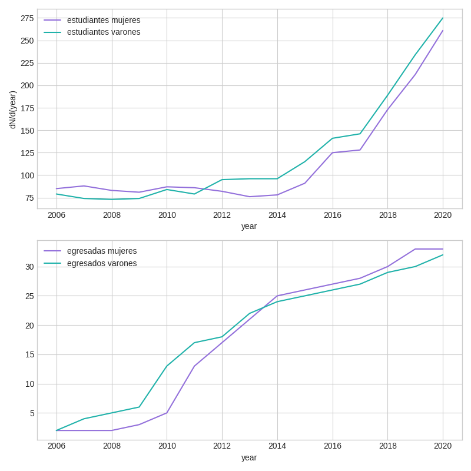
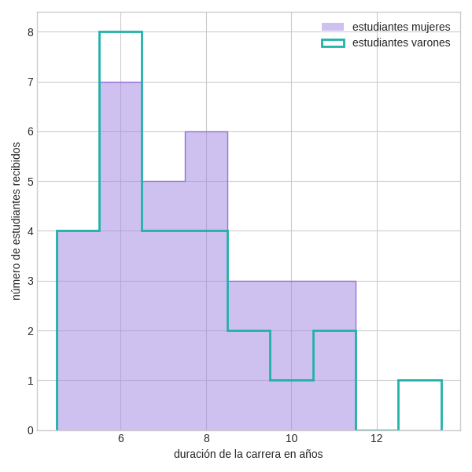
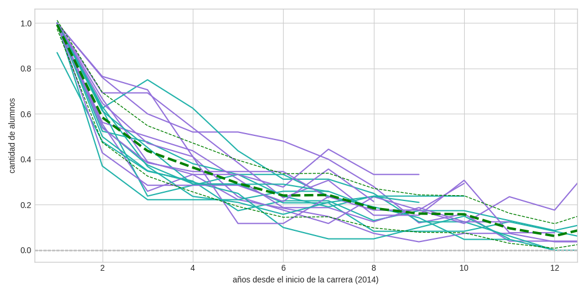
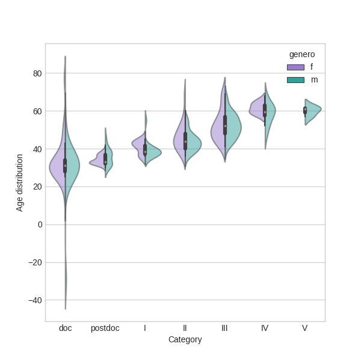
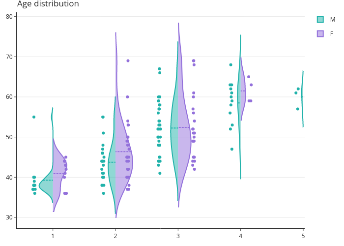

Figures
===============================

The figures to analyze the performance in the astronomy career
according to genders can be easily generated with provided code.

The code is located in `ASTROGEN/astrogen/dataviz <https://github.com/mlares/astrogen/tree/main/astrogen/dataviz>`_, and plots are saved into astrogen/figures.

Data to make these plots is in the file astrogen_DB_anonymized.db,
which must be placed in astrogen/data/redux, and can be downloaded
from dryad...

UNC
--------

.. code-block:: bash

   cd astrogen/astrogen/dataviz
   python visualize_unc

CONICET
--------

.. code-block:: bash

   cd astrogen/astrogen/dataviz
   python visualize_conicet

PUBLICATIONS
----------------

.. code-block:: bash

   cd astrogen/astrogen/dataviz
   python visualize_publications
